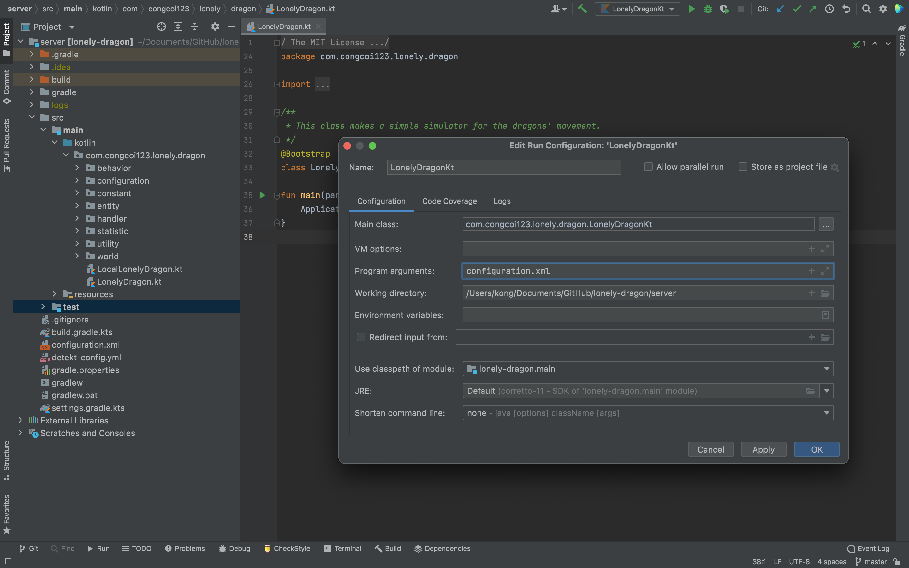
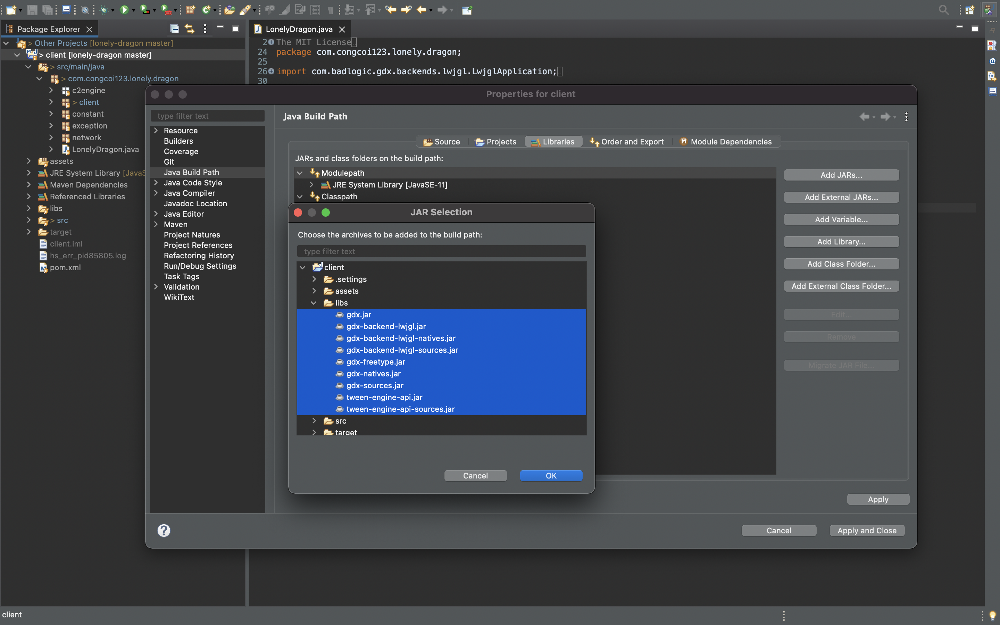
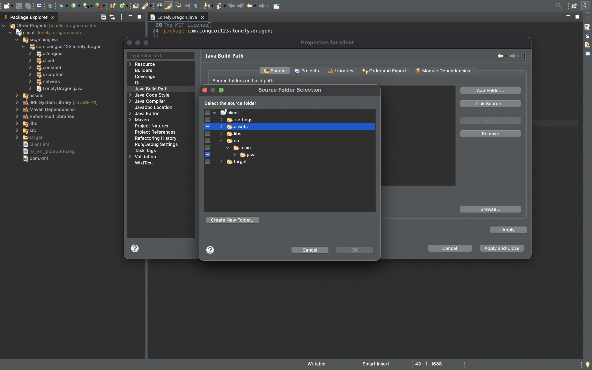

<p align="center">
    <a href="#">
        
    </a>
</p>
<p align="center">
    <a href="LICENSE">
        
    </a>
    <a href="#">
        
    </a>
    <a href="https://github.com/congcoi123/lonely-dragon/issues">
        
    </a>
    <a href="CONTRIBUTING.md">
        
    </a>
    <a href="https://gitter.im/ten-io/community?source=orgpage">
        
    </a>
</p>

# Lonely Dragon [](https://twitter.com/intent/tweet?text=TenIO%20is%20a%20java%20NIO%20based%20server%20specifically%20designed%20for%20multiplayer%20games.%0D%0A&url=https://github.com/congcoi123/tenio%0D%0A&hashtags=tenio,java,gameserver,multiplayer,nio,netty,jetty,msgpack,cocos2dx,unity,libgdx,phaserjs%0D%0A&via=congcoi123)
[`TenIO`](https://github.com/congcoi123/tenio) is an open-source project to create multiplayer online games that includes a java NIO (Non-blocking I/O) 
based server specifically designed for multiplayer games, which supports UDP, TCP, Websocket, HTTP transports, and available simple client projects for quick development.

This project demonstrates how to manipulate the frame to make a simple game with the server-side is made with Kotlin and the client app is supported by the Libgdx framework.contains a collection of examples that show you how to manipulate the framework.

## Dependencies
```txt
- tenio-core
- tenio-engine
- libgdx
```

## Requirements
- Intellij
- Eclipse
- Java 11

## How to install
### Server Side
Setups the configuration file as the program arguments like the following image.


### Client Side
Import the libraries manually by the follwing guilde.

Then add the `assets` directory as a *source folder*.


## License
The [`TenIO`](https://github.com/congcoi123/tenio) project is currently available under the [MIT](LICENSE) License.

## Changelog
Please check out the [changelog](CHANGELOG.md) for more details.

## Contributing
Please check out the [contributing guideline](CONTRIBUTING.md) for more details.

## Installation
```sh
$ git clone https://github.com/congcoi123/lonely-dragon.git
```

## Wanna see the result?
Then you should download the demo and follow the guides.
[Lonely Dragon](https://drive.google.com/drive/folders/1A3dWw3ccqPTiqJ8JqAweaTWiLalUwXlb?usp=sharing)

> Happy coding !
